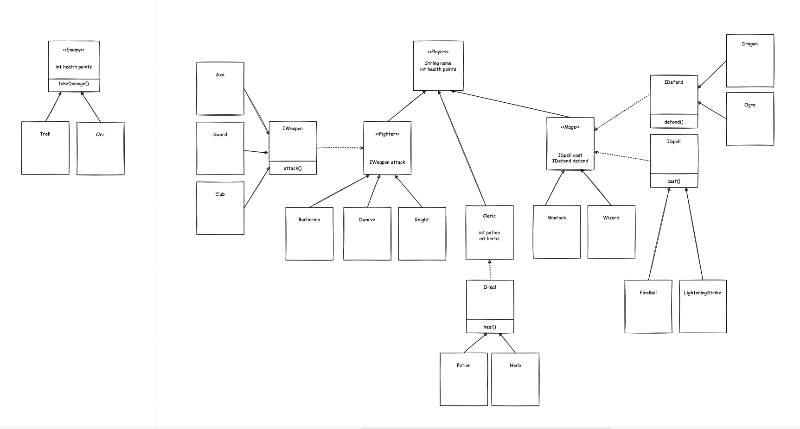

# Fantasy Adventure Lab

Java modelled fantasy adventure game. TDD lab, implemented 4 pillars and solid principles.

The game has players, who have a number of health points and weapons/spells. Players fall into different categories:

### Dwarves, Barbarians, Knights 
* Each of these have a weapon (Sword, Axe, Club) and can fight with other players. 
* Each are able to change their weapon at any point in the game.

### Warlocks and Wizards 
* They are able to cast spells (Fireball, Lightning Strike) on others.
* They can have a mythical creature (Ogre or Dragon) who will defend them from attackers.
* They are able to change spells or creature at any point in the game.

-----------------------------------------

### Clerics 
* They have healing tools (potion, herbs) with which they can heal other players.
* They are able to change healing tool at any point in the game.

The game will also have rooms to work through. Each room should either have some kind of treasure (Gold, Gems) to collect or an Enemy (Troll, Orc) to defeat before moving on.

#
## MVP
* Create the players and rooms for the adventure. (Don't worry about giving the rooms any exits.)
* Give different players properties/methods that are specific to their own class. (e.g. a Knight could have armour that could reduce damage they take)
* The user should complete rooms by either collecting treasure or defeating an enemy and a new room will be presented to them.

## Extensions
* Create a Quest for the players to work through. Possibly a collection of rooms to go through and the quest completes when all rooms are completed
* Expand any other way you wish.

### <a href="https://github.com/codeclan/g28_classnotes/blob/main/week_12/day_3/fantasy_adventure_lab/fantasy_adventure_lab.md">
Full brief</a>
#

### <a href="https://github.com/codeclan/g28_classnotes/blob/main/week_12/day_3/fantasy_adventure_lab/fantasy_lab_detailed.md">
Full brief detailed</a>
#